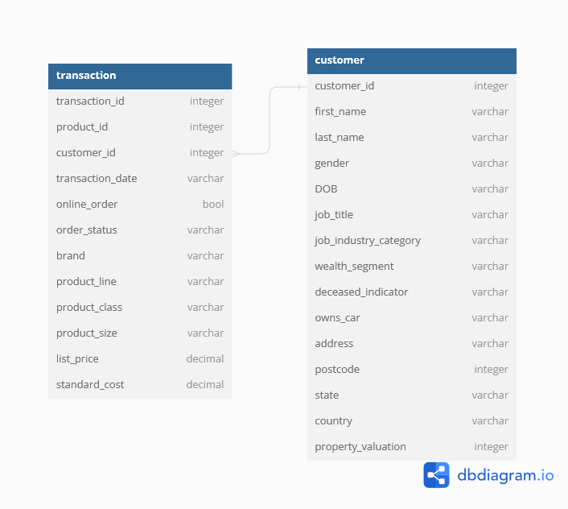
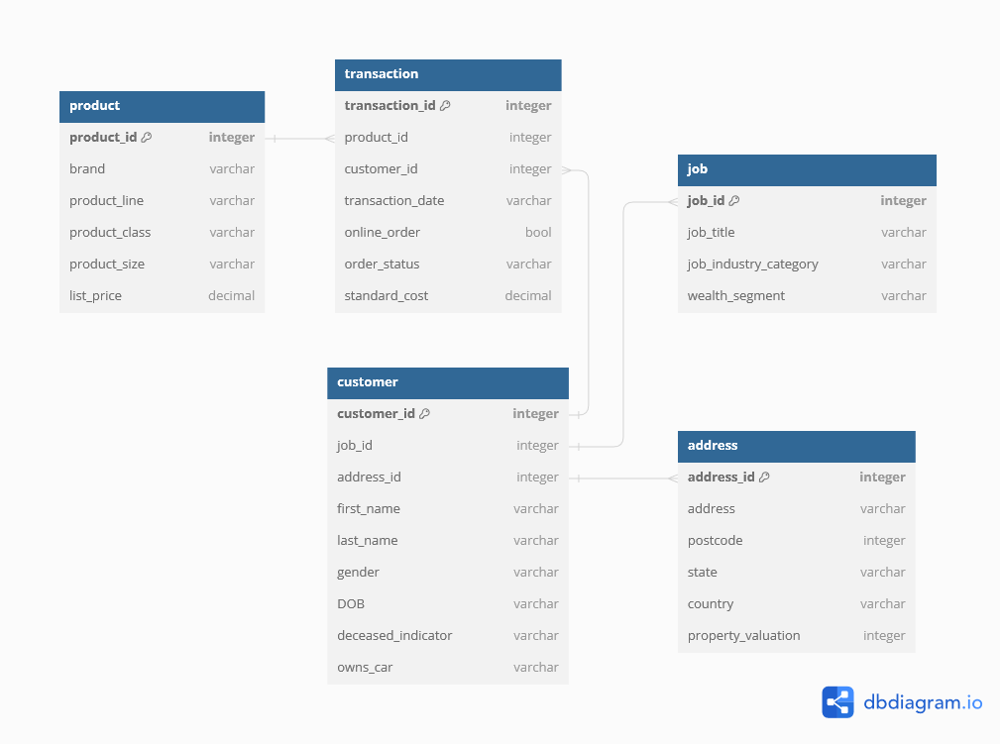

# Нормализация БД

## Первая нормальная форма

Исходно данные имеют следующий вид

В данной БД каждый атрибут является простым, а атрибуты <code>transaction_id</code> и <code>customer_id</code> являются потенциальными ключами, то есть не имеют дублирующих значений, а значит обеспечивают уникальность каждой записи. Таким образом, **отношения в данной БД соответствуют первой нормальной форме**.  

## Вторая нормальная форма

Для того, чтобы отношения соответствовали второй нормальной форме необходимо выбрать первичный ключ таким образом, чтобы все неключевые атрибуты зависели от ключа целиком. Чтобы выполнить это условия, достаточно, чтобы первичный ключ не был составным. Тогда, **если в качестве первичных ключей выбрать <code>transaction_id</code> и <code>customer_id</code>, то обе таблицы будут находится во второй нормальной форме**.

## Третья нормальная форма

В приведённой выше структуре БД есть неключевые атрибуты, которые не непосредственно зависят от ключей, а имеют транзитивную зависимость. Например, <code>product_class</code> зависит от <code>priduct_id</code>, который уже в свою очередь завсит от <code>transaction_id</code>. Таким образом, чтобы перейти к третьей нормальной форме необходимо избавиться от транзитивных отношений путём их декомпозиции.

