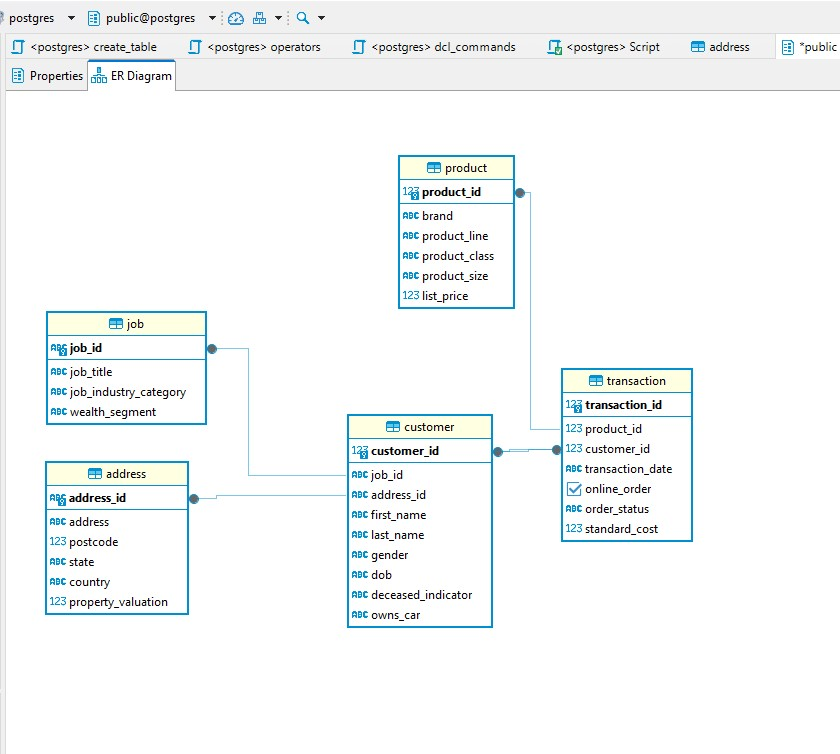
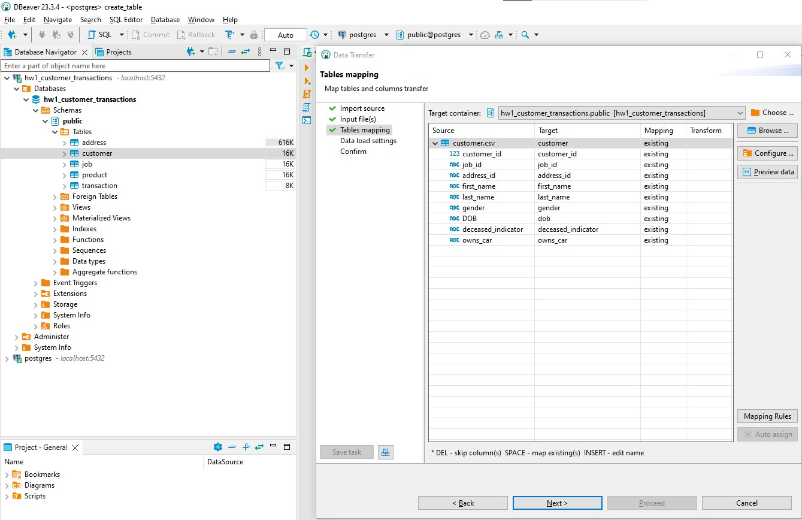
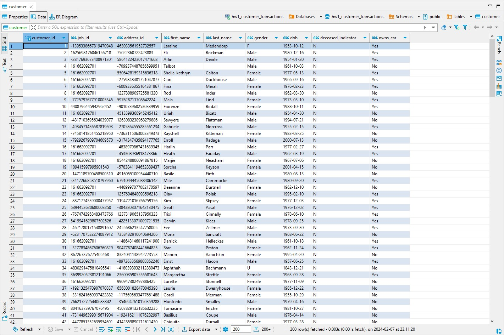

# Работа в DBeaver

## Создание таблиц

Процесс создания таблиц в [sql скрипте](hw1_create_tables.sql)

## Загрузка данных

Загрузка осуществляется через графический интерфес DBeaver:

После успешной загрузки, данные отоброзятся в таблице:

